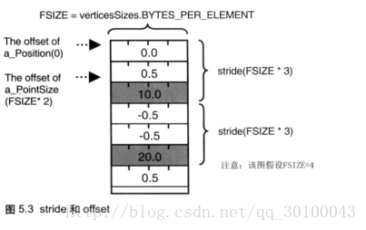

### 9.设置各个点的尺寸
#### 9.1 顶点与尺寸分开 
绘制三个点，三个点的大小不一样
1.创建顶点缓冲区
2.创建顶点尺寸缓冲区
[方式1](09.html)

>创建多个缓冲区，向着色器传值；这只适合数据量少的情况
#### 9.2 顶点尺寸放在一起
```
var verticesSizes = new Float32Array([
    0.0,0.5,10.0,

    -0.5, -0.5,20.0,

    0.5,-0.5,30.0
]);
```
前面两个数据是点的位置信息，第三个数是尺寸信息
gl.vertexAttribPointer(position,2,gl.FLOAT,false,FSIZE*3,0);
gl.vertexAttribPointer(pointSize,1,gl.FLOAT,false,FSIZE*3,FSIZE*2);
FSIZE*3 是一个数据组的大小，而一个数据包含了点位置和尺寸

所以用 第六参数和第二参数去设置；FSIZE是得到数组中每个元素的大小（字节数）
如：var FSIZE = verticesSizes.BYTES_PER_ELEMENT;//得到数组中每个元素的大小（字节数）
 

解读上面意思：一个数据节的大小是FSIZE*3（它里面包含了位置和尺寸），从O开始读两个数据（也就是0.0 和0.5），
传入到a_Position 缓冲区中，a_Position 缓冲区绑定到着色器里的a_Position;然后着色器才去一一执行； 如果还不明白，那我就简单比喻，就好比一个流水线一样，
现在我用盒子把点和尺寸装起来，现在流水线上就是一个一个的盒子，告诉机器，一个盒子是一个点的信息，盒子里面的前两个是位置信息，
后面一个是尺寸；这样就很好的区分，也把一个数据包装在一起；


[方式2](09.1.html)

### 10.设置各个点的颜色
方式与9类似
```
   //创建缓冲区
            var vertices = new Float32Array([
                0.0,   0.5,  1.0,0.0,0.0,
				-0.5, -0.5,  0.0,1.0,0.0,
				 0.5, -0.5,  0.0,0.0,1.0
            ]);
```
前两个为顶点坐标，后三个为颜色
```
     var vertexBuffer = gl.createBuffer();
            gl.bindBuffer(gl.ARRAY_BUFFER, vertexBuffer);

            gl.bufferData(gl.ARRAY_BUFFER, vertices, gl.STATIC_DRAW);
            gl.vertexAttribPointer(position, 2, gl.FLOAT, false, FSIZE*5, 0);
            gl.enableVertexAttribArray(position);

            gl.bindBuffer(gl.ARRAY_BUFFER, vertexBuffer);
            gl.bufferData(gl.ARRAY_BUFFER, vertices, gl.STATIC_DRAW);
            gl.vertexAttribPointer(aColor, 3, gl.FLOAT, false, FSIZE*5, FSIZE*2);
            gl.enableVertexAttribArray(aColor);

            gl.drawArrays(gl.POINTS, 0, n);  
```
主要是顶点着色器与片元着色器设置
```
    <script id="vs" type="x-shader/x-vertex">
        attribute vec4 position; 
		attribute vec4 a_Color; 
		varying   vec4 v_Color;
		void main(void){ 
			v_Color=a_Color; 
			gl_Position=position; 
			gl_PointSize=10.0;
			}
    </script>

    <script id="fs" type="x-shader/x-fragment">
		precision mediump float;
		varying vec4 v_Color;
        void main(void){ gl_FragColor =v_Color; }
    </script>
```
这里注意设置：gl_PointSize=10.0;顶点大小，不然看不到效果

### 11.WebGL使用纹理贴图
[案例](https://blog.csdn.net/qq_30100043/article/details/72771864)

#### 11.1 WebGL使用多幅纹理
案例 11.2.html